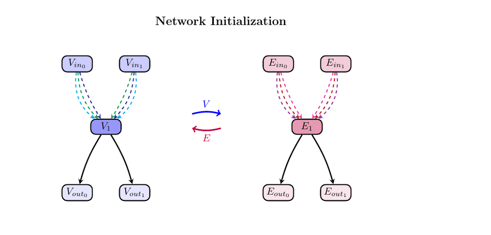

# Automatic Relation-aware Graph Network Proliferation
---

## Relation-aware Graph Search Space


## Network Proliferation Search Paradigm

<!--  -->


## Environment
Try the following command for installation. 
```sh
# Install Python Environment
conda env create -f environment.yml
conda activate gnas
```

## Download datasets
Some datasets (CLUSTER, TSP, ZINC, and CIFAR10) are provided by project [benchmarking-gnns](https://github.com/graphdeeplearning/benchmarking-gnns), the others (ModelNet10 and ModelNet40) are provided in [Princeton ModelNet](http://modelnet.cs.princeton.edu/). 
|DATASET|TYPE|URL|
|---|---|---|
|CLUSTER|node|[click here](https://data.dgl.ai/dataset/benchmarking-gnns/SBM_CLUSTER.pkl)|
|TSP|edge|[click here](https://data.dgl.ai/dataset/benchmarking-gnns/TSP.pkl)|
|ZINC|graph|[click here](https://data.dgl.ai/dataset/benchmarking-gnns/ZINC.pkl)|
|CIFAR10|graph|[click here](https://data.dgl.ai/dataset/benchmarking-gnns/CIFAR10.pkl)|
|ModelNet10|graph|[click here](http://modelnet.cs.princeton.edu/)|
|ModelNet40|graph|[click here](http://modelnet.cs.princeton.edu/)|


## Searching
We have provided scripts for easily searching graph neural networks on six datasets. 
```shell
python start.py gpu=0 repeats=4 data=ZINC save='archs/start'
```

## Training
We provided scripts for easily training graph neural networks searched by EGNAS.
```python
CUDA_VISIBLE_DEVICES=0 python train.py ds=ZINC  optimizer=train_optimizer ds.load_genotypes='archs2/start/repeat3/ZINC/45/cell_geno.txt'
```


## Visualization
We provided a python script for easily visualize searched architectures. 
Just run the following command. 
```python
python utils/plot_genotype.py
```

